# Entrance Exam Prep (Flutter Mobile)

Mobile version of the Grade 12 entrance exam preparation platform. Built with Flutter, it shares the **same backend API** as the React web platform and utilizes a **modular clean architecture** for maximum scalability and speed.

---

## ⬇️ Download & Install (No Setup Required)

> Want to try the app immediately **without building from source**? Download the pre-built release APK below.

| | |
|---|---|
| 📦 **File** | `app-release.apk` |
| 📏 **Size** | 54.6 MB |
| 🤖 **Platform** | Android 6.0+ (API 23+) |
| 🔗 **Download** | [**⬇ Download APK from Releases**](../../releases/latest) |

### 📲 How to Install

1. Download the `app-release.apk` file from the [Releases](../../releases/latest) page.
2. Transfer it to your Android device (if downloaded on PC).
3. On your device, go to **Settings → Security → Enable "Install from Unknown Sources"**.
4. Open the APK file and tap **Install**.
5. Launch **Entrance Exam Prep** from your app drawer.

> [!NOTE]
> The app requires an active internet connection to load content from the backend API.

---

## 📱 App Screenshots & Pages

Below are screenshots and descriptions of the core screens in the application, highlighting the polished UI and features:

| **Home Dashboard** | **Chapters List** | **Topic Hub** |
| :---: | :---: | :---: |
| 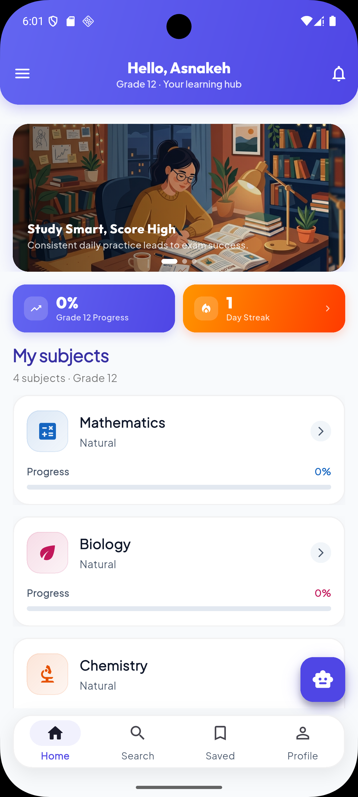 | 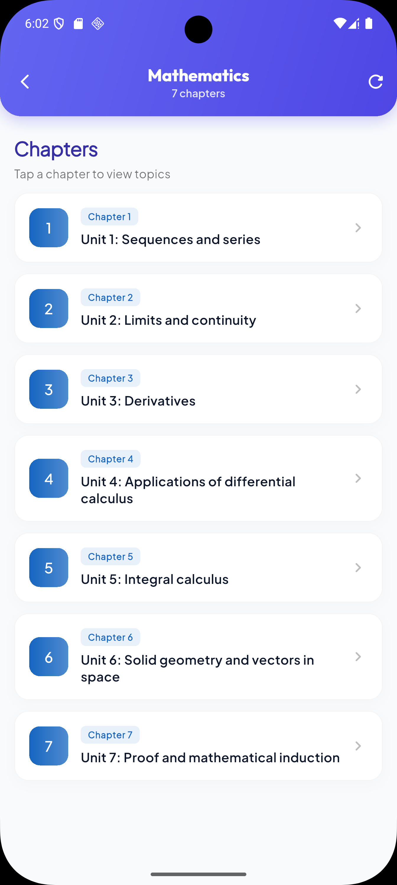 | 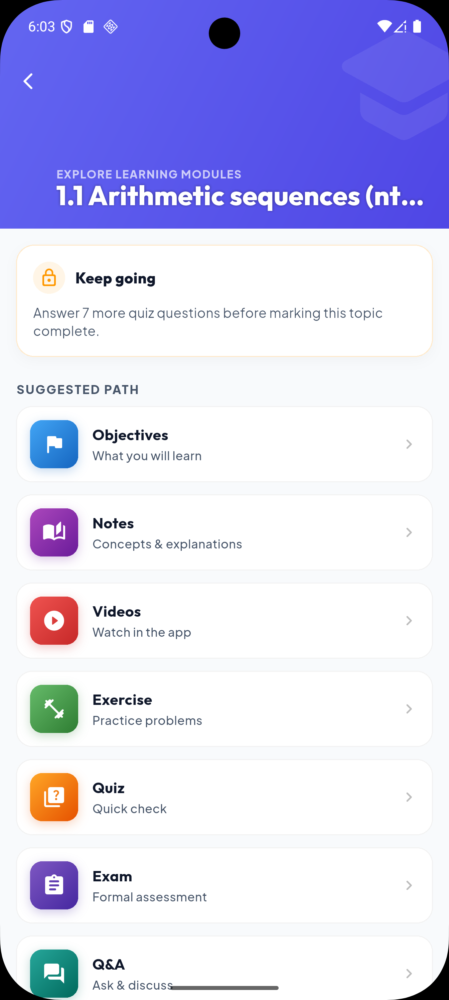 |
| Weekly progress charts, stats, and quick-access subjects (Physics, Maths, Biology). | Interactive chapter list showing topic counts and progress completion rings. | The centralized hub for all topic learning modules (notes, videos, quizzes, etc.). |

| **Concept Notes** | **Lecture Video Player** | **Exam Hub** |
| :---: | :---: | :---: |
| 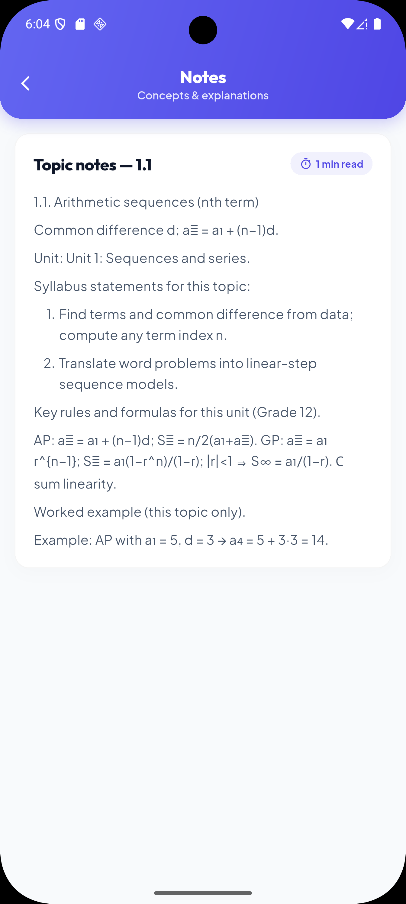 | 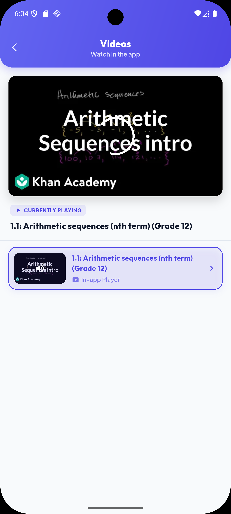 | 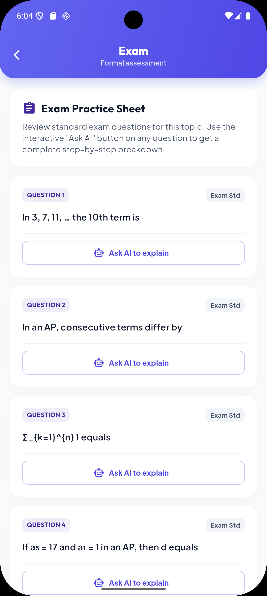 |
| Clean textbook concepts and explanations rendered in native markdown. | In-app native YouTube player with custom playlist navigation and inline video swap. | Interactive mock exams and tests with detailed feedback and timing tracking. |

| **AI Study Partner** | **Saved Bookmarks** | **Search Center** |
| :---: | :---: | :---: |
| 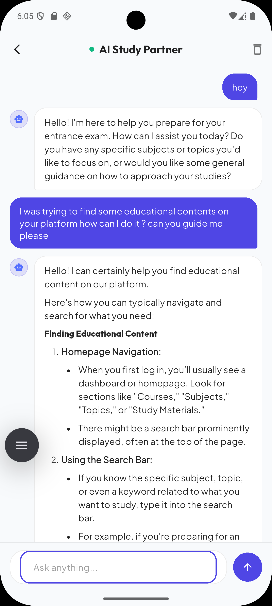 | 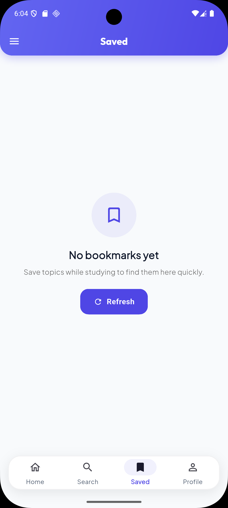 | 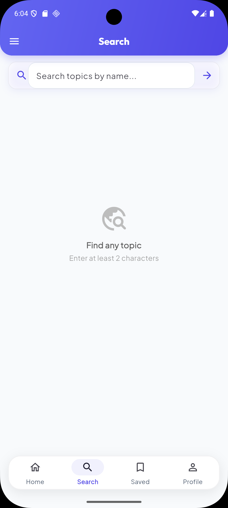 |
| Interactive AI tutor chat for asking complex questions and getting step-by-step guidance. | Saved formulas, questions, and topics kept for quick offline-ready reference. | Global search interface to quickly find content, chapters, or questions. |

| **Profile Page** | | |
| :---: | :---: | :---: |
| 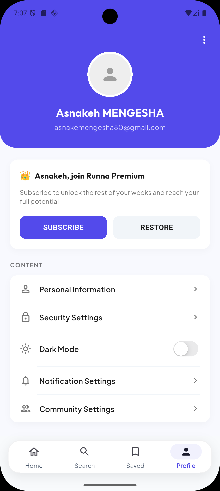 | | |
| Student profile with avatar, premium card, and settings (Personal Information, Security, Dark Mode). | | |

---

## 🌙 Dark Mode Screenshots

The app features a fully polished **dark mode** with deep navy backgrounds, soft card surfaces, and consistent theming across every screen — no white cards or ugly contrasts.

| **Home (Dark)** | **Chapter List (Dark)** | **Topic List (Dark)** |
| :---: | :---: | :---: |
| 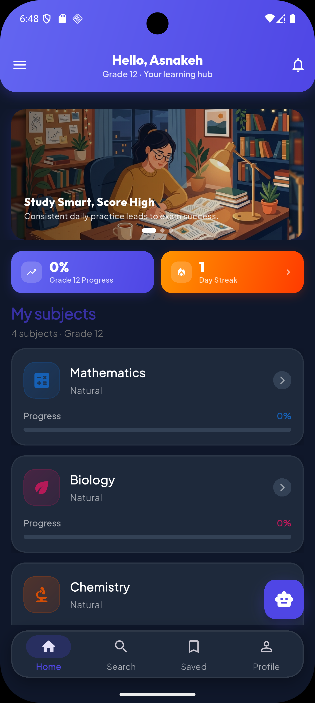 | 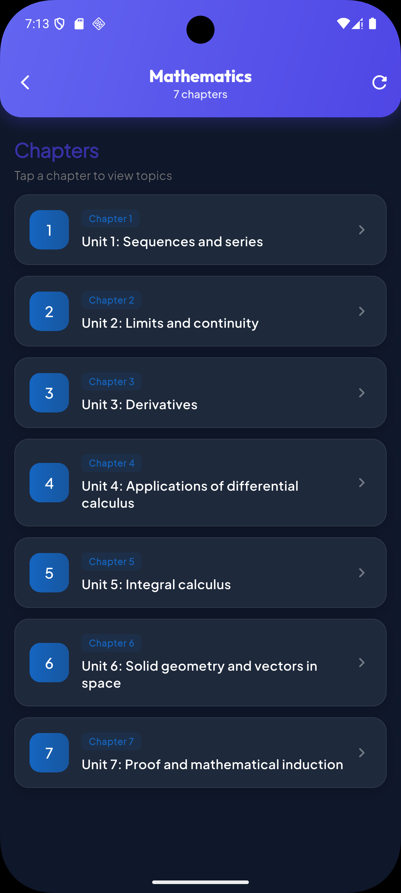 | 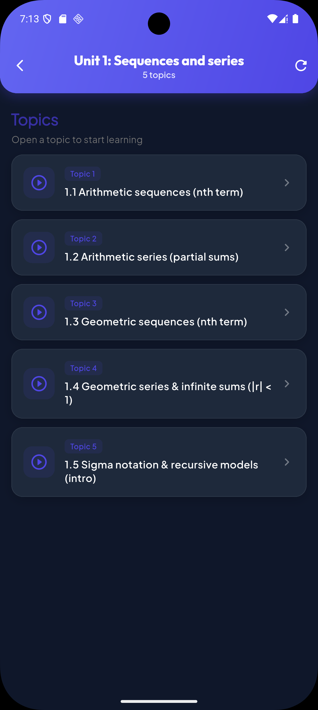 |
| Dashboard in dark mode with subject cards, progress charts and streak tracker. | Chapters list with dark card surfaces and completion indicators. | Topic list rendered with deep background and contrast-safe text. |

| **Topic Detail (Dark)** | **Video Player (Dark)** | **Search (Dark)** |
| :---: | :---: | :---: |
| 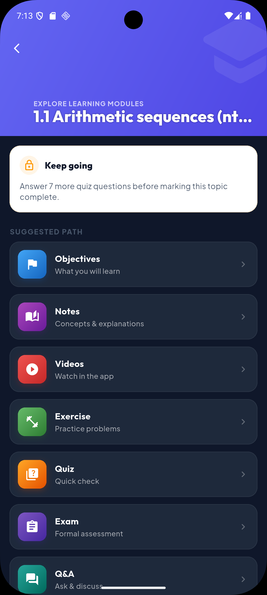 | 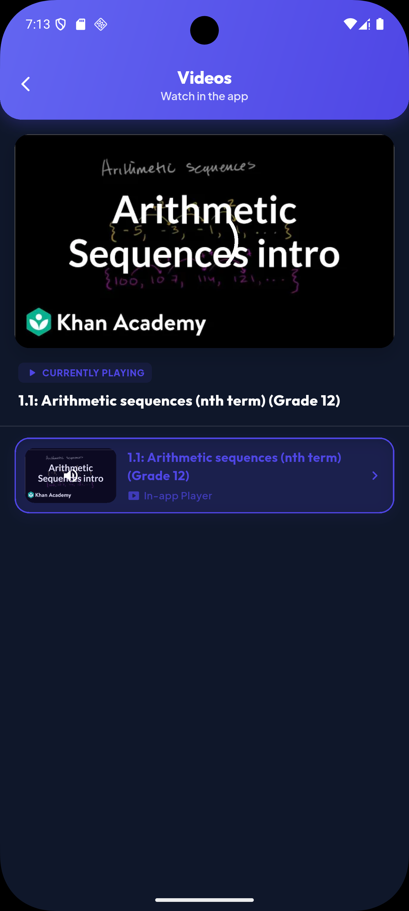 | 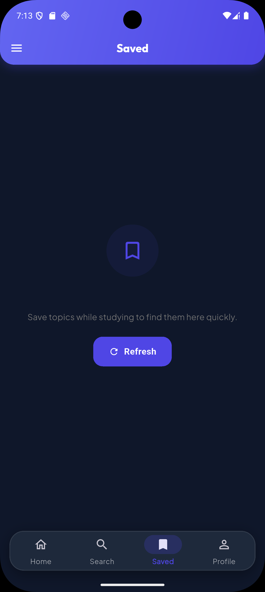 |
| Topic hub with tab navigation styled for dark theme. | Lecture video player with dark controls and playlist. | Search interface with dark input fields and result cards. |

| **Profile (Dark)** | **Drawer (Dark)** | |
| :---: | :---: | :---: |
| 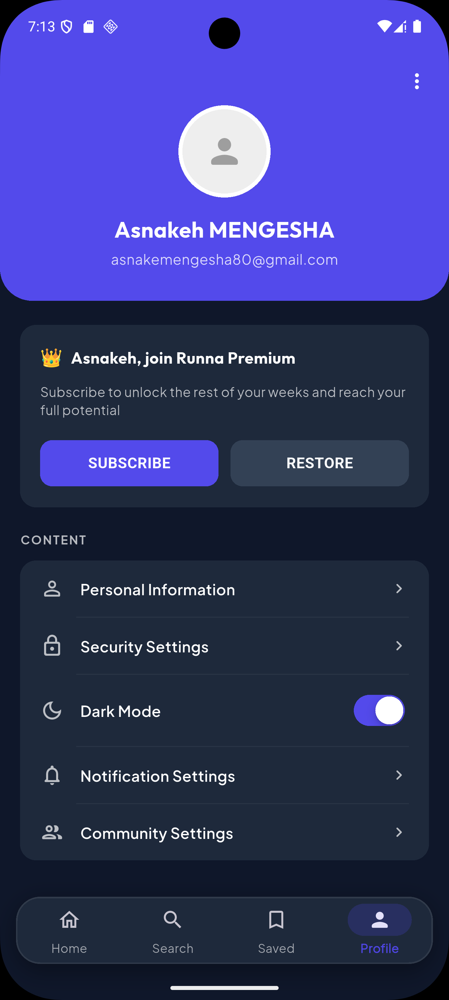 | 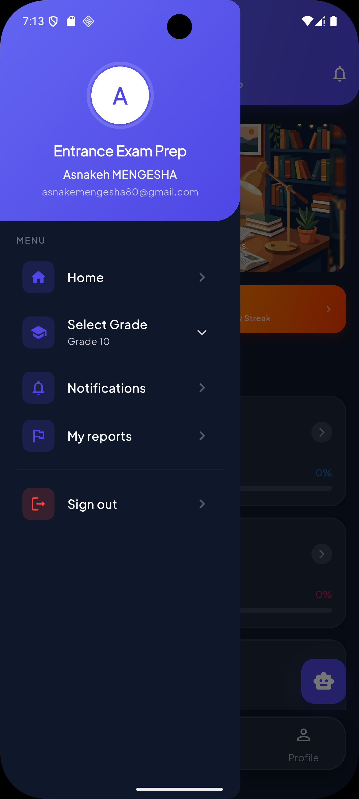 | |
| Profile page in dark mode with themed cards and settings. | Side navigation drawer with dark background and icon theming. | |

---

## 🚀 Getting Started

### Prerequisites

* Flutter SDK (3.9.x or newer)
* Android SDK / iOS Xcode

### Run in Development

```bash
# Navigate to project directory
cd finalyearproject

# Fetch package dependencies
flutter pub get

# Launch the app on connected emulator or device
flutter run
```

---

## 🌐 API Configuration

By default, the app points to the production API (matching the React web frontend):

`https://final-year-project-2-entrance-exam.onrender.com/api`

To override the endpoint for local development (e.g. running the backend locally), edit [util.dart](file:///D:/Mobile%20App%20Final%20Year%20Project/finalyearproject/lib/core/constants/util.dart):

```dart
// Android emulator → localhost:5000
const String apiUrl = 'http://10.0.2.2:5000/api'; 
```

---

## 📁 Project Architecture

The codebase follows the **Feature-First Clean Architecture** structure:

```
lib/
├── core/           # API clients, colors, premium theme, shared widgets
├── shared/         # Auth gate, routing, state providers
└── features/
    ├── auth/       # Login, registration, password recovery (glowing neon gradients)
    ├── student/    # Student dashboard, custom navigation docks, drawers
    ├── curriculum/ # Subjects → chapters → topics curriculum tree
    ├── content/    # Content modules (objectives, concepts, videos, practice)
    ├── engagement/ # Progress tracking, bookmarks, notifications, Q&A boards
    ├── teacher/    # Course/content CRUD, Q&A moderation tools
    ├── admin/      # User management, course approvals
    ├── profile/    # Student/Teacher profile pages
    └── ai/         # AI Study Partner chatbot interface
```

* **Domain layer**: Defines models and business logic.
* **Data layer**: Implements remote/local data sources (`*_remote_data_source.dart`).
* **Application layer**: Manages state using Riverpod providers.
* **Presentation layer**: UI layouts, custom widgets, and pages.

---

## 👥 Role Privileges

* **Student**: Access to dashboards, learning pathways, AI Tutor chatbot, practice tests, and performance bookmarks.
* **Teacher**: Management portal for subjects, chapters, and topics; Q&A thread management.
* **Admin**: Subject CRUD and global user moderation dashboards.

---

## 👥 Group Contributors

| 🧑‍💻 Name | 🆔 Student ID |
| :--- | :--- |
| **Aman Atalay** | `UGR/4364/15` |
| **Asnake Mengesha** | `UGR/9465/15` |
| **Daniel Shitaye** | `NSR/9066/14` |
| **Fraol Dereje** | `UGR/6955/15` |

